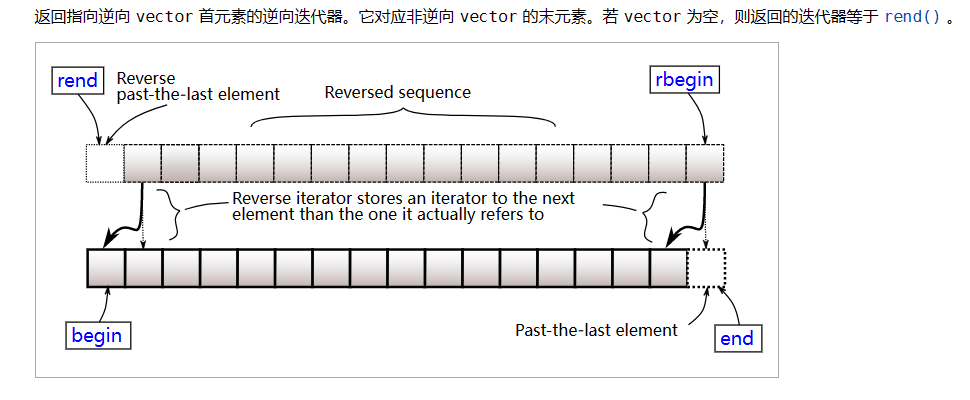

- 求反序数
```cpp
//求一个int类型数的反序数

int reserve(int x)
{
    int revx =0; 
    while(x!=0)
    {
        revx*=10;    //对给定数逐次除10求余
        revx+=x%10;
        x/=10;
    }
    return revx;
}


```
- **润年的判断**  
  年数不能被100整除时能被4整除**或者**能被400整除  
  `(y % 4 == 0 && y % 100 != 0) || (y % 400 ==0)`

- **`printf`的格式化输出**  
  指定输出数据的宽度`%m.nf`
  - %2d表示输出宽度为2的整数，超过2位按实际输出，不够2位右对齐输出。
  - %02d表示输出宽度为2的整数，超过2位按实际输出，不够2位前置补0。
  - %5.2f表示输出宽度为5的浮点数，其中小数点后有2位，不够5位右对齐输出。

- **使用`sscanf()`解析字符串**


- **区间合并算法**  
  将所有区间按照左端点从小到大排序。  
  排序后，当前区间和下一区间有三种情况：  
  1. 下一区间的左端点大于当前端点的右端点——将下一区间作为当前区间  
  2. 下一区间的左端点小于当前区间的右端点且右端点小于当前区间的右端点——无序操作，将下一区间移除重复操作。
  3. 下一区间的左端点小于当前区间的右端点且右端点大于当前区间的右端点——更新当前区间的右端点为下一区间的右端点。移除下一区间。

  ```cpp
  //使用map可以很方便实现以上过程
  map<int,int> region;

  map<int,int>::iterator iter;  //指向当前区间的迭代器
  map<int,int>::iterator next;  //指向下一区间的迭代器

  for(int i=0; i<n; i++)
    region.insert({start,end});  //添加区间对,因为map和set是默认按关键字排序

  iter = region.begin();         //map的元素类型是pair，first是左端点，second是右端点，first是关键字，second是值

  while(iter != region.end())
  {
    next = iter;
    if(++next = region.end())  
      break;
    
    if(next->first <= iter->second)
    {
      if(next->second < iter->second)
        iter->second = next->second;
      region.erase(next);
    }
    else 
      iter++;
  }  //最终完成集合的合并

  ```

- **两个字母间的距离**


- **string的substr()操作**

- **string的find()操作**

- **使用sort**
  ```cpp
  sort(first,last,comp);  //first、last为待排序列的起始地址和终止地址；comp是排序方式，可以不填，默认升序
  ```
  自定义排序方式：  
  排序函数是一个返回类型为布尔类型的函数;
  ```cpp
  bool Compare(T x, T y) // 类型为待排序列的数据类型
  {
    return x<y;   // x<y时返回值为true，x排在y的前面，sort为升序排列
  } //当返回值为true时，参数x会排在参数y的前面
  ```


- **vector的逆向迭代器**
  注意vector的逆向迭代器`rbegin()`和`rend()`所指的位置:
  `rbegin()`指向尾元素，`rend()`指向首元素的前一个位置
  


- **二分查找**

  二分查找的一般模板,元素升序排列。

  ```cpp
  bool binarySearch(int arr[], int target, int length) 
  {
    int left=0,right=length-1;
    int middle;

    while(left <= right)
    {
      middle = (left+right)/2;
      if(target > arr[middle])
        left = middle;
      else if(target < arr[middle])
        right = middle;
      else
        return true;  //已找到
    }
    return false; // 未找到
  }

  ```

- **函数传递数组参数**  
  对与数组，数组名即为数组首元素的地址：  
  `int a[10]={0};` 则 `a` 与 `&a[0]` 等价，都是数组`a`的首元素地址。  
  传递数组参数都是传递数组的首地址。形式参数只能是接收地址的形式;（以整型数组为例）两种接收参数方式等价。

  1. 用数组接收
  ```cpp
  void test(int arr[]) //用数组接收,不用传输数组大小，[]只用来表示参数是数组
  {
    printf("%d", *arr);
    printf("%d", *(arr+1));
  }

  int main()
  {
    int arr[5] = {1,2,3,4,5};

    test(arr);
  }
  ```
  2. 用指针接收 
  ```cpp
  void test(int *arr)  //用指针接收
  {
    printf("%d", *arr);
    printf("%d", *(arr+1));
  }

  int main()
  {
    int arr[5] = {1,2,3,4,5};

    test(arr);
  } 

  ```